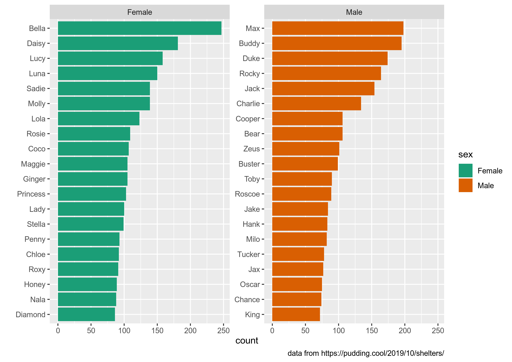
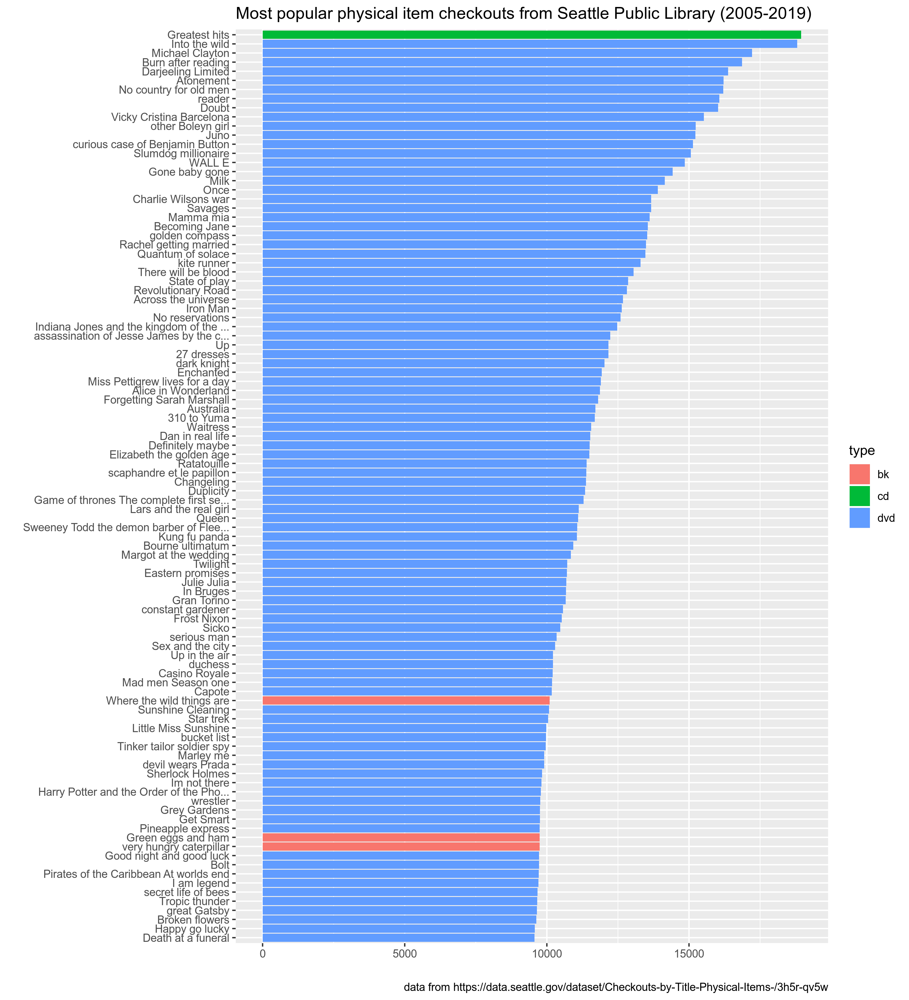

```{r, message=FALSE, include=FALSE}
library(tidyverse)
library("readxl")
knitr::opts_chunk$set(message = FALSE)
```

## Задание 1.1

На Pudding вышла [статья "Finding Forever Homes"](https://pudding.cool/2019/10/shelters/), посвященная миграции и эмиграции собак в США. В вашем репозитории лежит немного обработанный датасет `dog_names.csv`, которые использовался в статье. Датасет состоит из 58 113 строк и 5 переменных:

* `id` -- уникальный  id с сервиса PetFinder
* `name` -- кличка собаки
* `sex` -- пол собаки (`Female`, `Male`, or `Unknown`)
* `age` -- категориальная переменная с возрастом собаки (`Baby`, `Young`, `Adult`, `Senior`)
* `contact_state` -- штат, в котором находиться приют

Заполните пропуски ниже, так чтобы получился следующий график. На нем изображено по 20 самых популярных кличек собак живущих в приютах в США для каждого пола. Обратите внимание на подписи осей. Нестанадртные цвета на этом графике появились благодаря команде `scale_fill_brewer(palette="Dark2")`.



```{r}
dog_names <- ...("dog_names.csv")

dog_names %>% 
  ...
  ggplot(...) +
  ... +
  scale_fill_brewer(palette="Dark2")
```

## Задание 1.2

Используя датасет из предыдущего задания, заполните пропуски, так чтобы получившаяся программа считала, какую долю составляют собаки разного возраста в подгруппах по полу. Должно получиться что-то такое:

```
# A tibble: 4 x 3
  age      Male Female
  <chr>   <dbl>  <dbl>
1 Adult  0.476  ...
2 Young  ...    ...
3 Baby   ...    ...
4 Senior ...    ...
```

На всякий случай: доли в каждом из столбцов должны давать в сумме 1 (при округлении), если у Вас выходит значительно больше -- значит что-то Вы делаете не так, как ожидается. Постарайтесь, чтобы ответ получался в одну цепочку пайпов.

```{r}
dog_names %>% 
  ...

```

## Задание 1.3

В датасете `seattle_public_library_checkouts.xlsx` содержаться информация об объектах, выданных библиотекой Сиэтла 100 и более раз (исходные данные доступны [здесь](https://data.seattle.gov/dataset/Checkouts-by-Title-Physical-Items-/3h5r-qv5w)). Датасет состоит из разбитых на листы файла `.xlsx` 180 495 строк и  5 переменных:

* `id` -- идентификационный номер объекта
* `type` -- тип объекта (`bk` -- книга, `bknh` -- другая категория с книгами, `cas` -- кассеты, `cd` -- CD, `dvd` -- DVD, `kit` -- комплект (я сам пока не разобрался что там...), `vhs` -- видеокассеты VHS)
* `name` -- название
* `n` -- сколько раз взяли в том или иному году
* `year` -- год

Используя датасет, заполните пропуски ниже, так чтобы получившаяся программа нарисовала следующий график. На графике изображены 100 самых популярных объектов за все годы.


  
```{r}
d2005 <- ...
...

d2005 %>% 
  bind_...() %>% 
  ...
  ggplot(...) +
  ...
```

